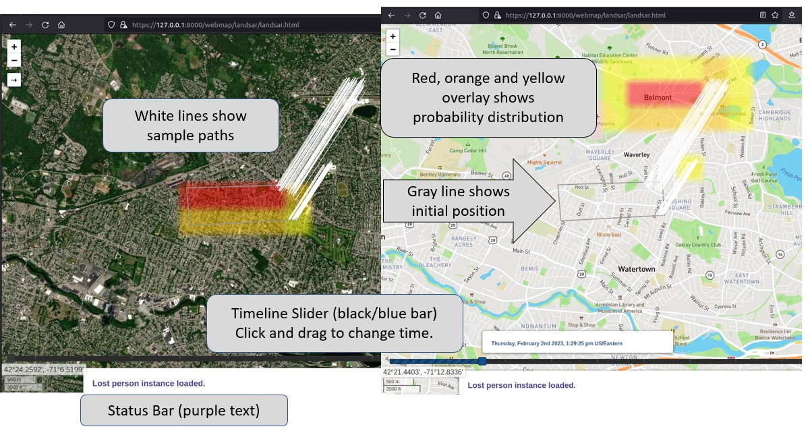
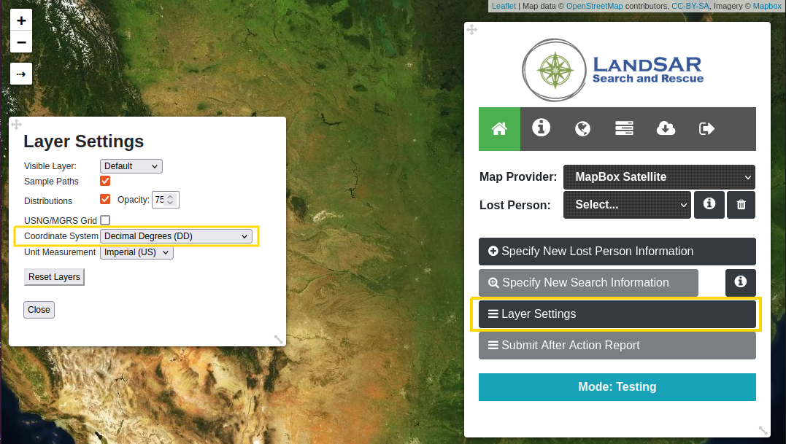

<br />
<p align="center">
  <a href="#">
    
  </a>
  <h1 align="center">LandSAR Base</h1>
  <h2 align="center">Test Harness for Motion Model Plugins</h2>
</p>


# Background and Setup
This document assumes you have the associated LandSAR Motion Model Software Development Kit (SDK), an implementation of a Motion Model Plugin, and want to test it out within the LandSAR system.

Please install Git LFS prior to cloning this repo: https://git-lfs.com/

## System Information
LandSAR Base excludes operational models and parameters found in the LandSAR system. 

LandSAR is implemented as a client/server application, with a Java-based server and several clients including browser-based and an Android Team Awareness Kit (ATAK) plugin. LandSAR Base only includes the browser-based client. 

### LandSAR Base Geospatial Data
LandSAR provides geospatial data to Motion Model Plugins via an interface called <b>AreaData</b>. Currently, the configuration for LandSAR Base points to a local cache of geospatial data.
The local cache is restricted to an area around Quabbin Reservoir, Massachusetts, with bounds: 41.76,43.0,-73.1,-70.0. There is a second local cache for an area in Virginia, with bounds: 38.0,39.0,-77.8,-77.2,
 "geocache-va". To switch to the new geocache, update the config.json to point to it instead of the Massachusetts one, and restart LandSAR Base.

```
              "geo cache directory": "geo_cache",              
              "geo cache directory": "geocache-va",
```
The top line shows the configuration (in config.json) for the Massachusetts geocache. The line below it shows the configuration for the Virgina geocache. Only one geocache can be used at a time. 

We are currently investigating options to provide access to CONUS elevation and landcover data currently used for LandSAR.

#### Landcover Metadata
LandSAR Base does not include meaningful Landcover Metadata Parameters. You can edit the file `landcover-defaults.txt`, to change the values of Landcover Metadata Parameters shown in the UI and used by LandSAR Base. 
LandSAR's Landcover Metadata file is a tab-seperated file with the following parameters: 
* Landcover Code -- <b>do not edit this column</b> 
* short description
* Speed of Advance Factor (greater than one is faster, less than one is slower)
* Cost (of traversing this landcover type)
* Terrain Resource Parameter
* Red, Blue, and Green values for the landcover type -- <b>do not edit these!</b>
* Detailed Description of the landcover

## Building Your Plugin Jar and Plugin Loading
Motion Model Plugins, as well as other components of LandSAR, are loaded via a framework called ROGER.
Plugins are loaded from the plugins/ subfolder, and their dependencies can be loaded from the dependencies subfolder.

In order to know which jar file contains which plugins, ROGER looks for a plugin manifest file, `plugin-manifest.json` in each of the jars in the plugins folder. Running the PluginManifestGenerator (see `src/test/java/PluginManifestGenerator` in the SDK) will create a plugin-manifest.json file for your jar in src/main/resources by reading the Plugin Annotation information. There is a plugin manifest in the SDK already.

You can add the Plugin Annotation, `@Plugin`, at the top of your java class, like this:

```
import com.bbn.roger.annotation.Plugin;
@Plugin
public class ExampleMotionModelPluginWithSearchEval implements LandMotionModelPlugin {
```

To instruct the Class Loader to load additional dependencies when loading your plugin, you can add them in the annotation, too:
`@Plugin(dependencies = {"gson-2.9.1.jar"})`.
The Class Loader will look in the dependencies/ directory for these jar files.

## Adding Your Motion Model

Edit the config.json document to add your java class to the loaded plugins in two places. 

The first place is as an entry in the list of plugins for the `UtilityService`. 


You'll want to add your plugin, with the `name` you want to see in the user interface, and the fully qualified classname of the plugin in the `className` attribute. You may need to add a comma after the prior entry. 

```
         "serviceType":"UtilityService",
         "pluginConfigurations":[
		{
			"name": "Example Plugin A",
			"className": "com.bbn.roger.osppre.plugin.motion_model_example_plugins.ExampleMotionModelPluginWithSearchEval"
		}
```

The second place is around line 183, in the configuration attribute `motion model plugin names`. This item is a comma-seperated list of plugin names, so add whatever name you selected for your plugin, like `Example Plugin A` to this list: 
before adding plugin A: `"motion model plugin names": "Simple Maritime Plugin",`

after adding plugin A: `"motion model plugin names": "Simple Maritime Plugin,Example Plugin A",`

Finally, make sure the jar containing your plugin is in the plugins/ folder. The example plugins are in the `roger-osppre-2.0.3.jar` and in the motion model sdk jar. 

# Running LandSAR Base
## Running on Linux
If you have a linux OS, you can run LandSAR Base by: 
1) installing gdal (https://gdal.org/) and Java 8
2) Running ./startServer.sh from this directory

## Running in Docker

### Docker Setup
The `Dockerfile` currently has the timezone set to `"America/New_York"`. If you're in a different time zone, please update the TZ variable in the Dockerfile so that you can use https to connect to LandSAR.
If running on windows, we recommend running in PowerShell so that `$PWD` can refer to the current directory when mounting the volume.

### Docker Commands
Create a Docker Network: `docker network create landsar-docker-network`

It is *VERY IMPORTANT* to run 'docker build' from this directory! The first time you run this, it can be slow as it installs gdal, java 8, and Ubuntu updates. This only has to be re-run if the Dockerfile changes. 
`docker build . --tag landsar-base`

To run LandSAR Base as a container named landsar-docker:
```
docker run -d -v $(pwd):/opt/roger:z --network landsar-docker-network -p 443:443 -p 8088:8088 -p 8443:8443 -p 8080:8080 -p 8081:8081 -p 8082:8082 -p 8000:8000 --name landsar-docker landsar-base 
```
To run as non root, add `--user "$(id -u):$(id -g)"` before `landsar-base` to the above command. 

Stop Running: `docker stop landsar-docker`

Remove the container: `docker rm landsar-docker`

To open a terminal in the container: `docker exec -it landsar-docker bash`

## Accessing LandSAR User Interface 
LandSAR Base currently only includes the browser-based client. You can access it using a supported web browser, Chrome or Firefox. 

Accessing the LandSAR UI:
1. Point your web browser to `https://127.0.0.1:8000/webmap/landsar/`
2. Accept warning about self-signed certificate
3. Sign in using: 
	* username: admin
	* password: demotime

### Using LandSAR
  <a href="#">
    
  </a>
This image shows results of a modeled Lost Person Instance at two different times, with different map backgrounds selected. Notice that sample paths don't change with the timeline slider, but the probability distribution does. 

## Removing Test Instance Data
You can remove any generated data files between server restarts with `./clean-up-data.sh`. If you don't clear the generated data, and your motion model plugin is writing out its state to disk, that state should get automatically re-loaded upon server restart. If you're running docker as root and get permission denied errors, you can open a terminal inside the running docker container and run the `./clean-up-data.sh` script from within the docker container as root before shutting it down.  

# Version
Document Version: April 2023 

## Change Notes

### Version Released April 2023
This Version of LandSAR Base corresponds to Motion Model SDK version 0.0.6-SNAPSHOT. 
- Bugfix for exclusion zones
- Removed Maritime Plugin
- Added additional geocache + documentation

### Version Released January 2023
This Version of LandSAR Base corresponds to Motion Model SDK version 0.0.5. 
- Motion Model Properties are now shown in alphabetical order
- Bugfix for showing paths from motion models
- Allow configuring server-default landcover metadata
- Added initial Frequently Asked Questions Section

# Frequently Asked Questions
<b>What format are these files (LandcoverLatLon.txt, Landcover.txt, LandcoverMetadata.txt, ElevationLatLon.txt) in? Do I need to provide implementations of them?</b>
They are in a custom format so AreaData for user-specified Bounding Boxes can be written to and loaded from disk. No implementation of these files is required. 

<b>What does the format of our motion model output need to be?</b>
See MotionModelResult.java in the Software Development Kit (SDK). 

<b>Where do we modify the LandSAR GUI to ask the relevant questions to tailor the motion model?</b>
You don't actually modify the GUI, you can return required attributes via the `getMotionModelParameters` method on your Motion Model Plugin. See the README that comes with the SDK for more information. 

<b>What is ROGER?</b>
ROGER is a systems integration & network bridging framework developed by Raytheon BBN. It is used to configure and load plugins that form the LandSAR Server.

<b>When is clean-up-data.sh necessary? Why?</b>
If you're running many test runs, this can delete previous runs (which are stored among a few different folders) without deleting anything you need. It deletes data for Lost Person Instances you've created without deleting configuration changes. 

<b>What coordinate system does LandSAR use? Are calculations (ex. `pt.getLatDeg()`) and visualizations different?</b>
LandSAR's coordinate system that is displayed in the user interface is dynamic. It can be changed in the Layer Settings of the LandSAR Web user interface. The calculations use decimal degrees when using the `pt.getLatDeg()` function and radians for the `pt.getLat()` function.  
  <a href="#">
    
  </a>
